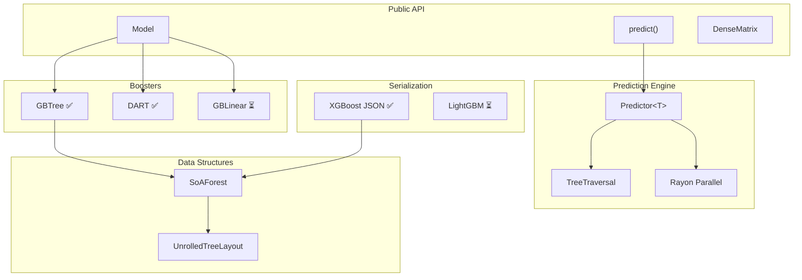

# booste-rs Design Documentation

This folder contains design documentation for the booste-rs library.

## Contents

| Folder/File | Description |
|-------------|-------------|
| [rfcs/](./rfcs/) | RFC-style design documents for major features |
| [research/](./research/) | Pre-RFC research, analysis, and exploration |
| [concepts/](./concepts/) | Explanations of key concepts and algorithms |
| [ROADMAP.md](./ROADMAP.md) | Implementation roadmap and milestone tracking |
| [CONTRIBUTING.md](./CONTRIBUTING.md) | Development workflow guide |
| [definitions_and_principles.md](./definitions_and_principles.md) | Core terminology and design principles |
| [NOTES.md](./NOTES.md) | Scratch notes and ideas |

## Architecture Overview

booste-rs is a high-performance gradient boosting library focused on inference speed.

### Current Status (2024-11-29)

| Component | Status | Performance |
|-----------|--------|-------------|
| GBTree inference | ✅ Complete | 9.4x faster than XGBoost (single-row) |
| DART inference | ✅ Complete | Weighted tree contributions |
| Batch prediction | ✅ Complete | 1.3x faster than XGBoost |
| Thread parallelism | ✅ Complete | 6.9x scaling at 8 threads |
| XGBoost JSON loading | ✅ Complete | Full compatibility |
| Categorical features | ✅ Complete | Bitset-based splits |
| GBLinear | ⏳ Planned | Research needed |
| LightGBM support | ⏳ Planned | Research needed |
| Training | ⏳ Planned | Research needed |

### High-Level Architecture



### Component Responsibilities

**Public API Layer**

- `Model` — Load/save interface, format conversion
- `predict()` — High-level prediction with batching and parallelism
- `DenseMatrix` — Feature matrix abstraction

**Prediction Engine**

- `Predictor<T>` — Generic predictor over traversal strategies
- `TreeTraversal` — Trait for tree traversal (Standard, Unrolled)
- Rayon integration for parallel batch processing

**Core Data Structures**

- `SoAForest` — Collection of trees with metadata ([RFC-0001](./rfcs/0001-forest-data-structures.md))
- `UnrolledTreeLayout` — Cache-optimized tree structure ([RFC-0002](./rfcs/0002-tree-data-structures.md))

**Serialization**

- XGBoost JSON — Complete support for GBTree, DART, categorical ([RFC-0007](./rfcs/0007-serialization.md))
- LightGBM — Planned

### Data Flow

```text
┌─────────────────┐
│  Model File     │  (XGBoost JSON, LightGBM, etc.)
└────────┬────────┘
         │ load()
         ▼
┌─────────────────┐
│     Model       │  (metadata, objective, booster)
└────────┬────────┘
         │ predict()
         ▼
┌─────────────────┐     ┌─────────────────┐
│   Predictor<T>  │◀────│  DenseMatrix    │
└────────┬────────┘     └─────────────────┘
         │
    ┌────┴────┐
    │ parallel │
    ▼         ▼
┌───────┐ ┌───────┐
│Block 1│ │Block N│  (Rayon work-stealing)
└───┬───┘ └───┬───┘
    │         │
    └────┬────┘
         ▼
┌─────────────────┐
│   Predictions   │
└─────────────────┘
```

## Design Process

1. **Research** — Analyze existing implementations, document in `research/`
2. **Concept** — Write up key algorithms/ideas in `concepts/`  
3. **RFC** — Propose design in `rfcs/` with clear scope and decisions
4. **Implement** — Build it, update RFC status
5. **Benchmark** — Validate performance in `../benchmarks/`

## Key Design Principles

From [definitions_and_principles.md](./definitions_and_principles.md):

1. **Zero-Cost Abstractions** — Rust generics compile to specialized code
2. **Semantic Naming** — Types reflect layout (`SoA`, `Packed`) not lifecycle
3. **Rust-First Safety** — Ownership and lifetimes over runtime checks
4. **Separation of Concerns** — Training vs inference, explicit conversion
5. **Zero-Copy Traversal** — Borrowed views, no structural copies
6. **Explicit Containers** — `Vec`, `Box`, `Arc` are part of the type

## Quick Links

- [RFC Index](./rfcs/README.md) — All RFCs with status and dependencies
- [Roadmap](./ROADMAP.md) — What's done, what's next
- [Benchmarks](../benchmarks/) — Performance results
