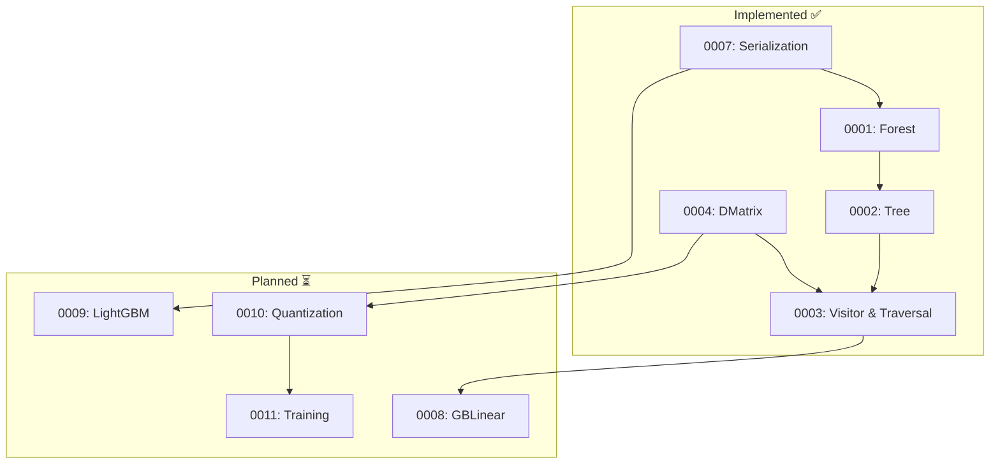

# RFCs (Request for Comments)

This folder contains RFC-style design documents for the booste-rs library.

## What is an RFC?

An RFC is a design document for a **specific feature or component**. Each RFC should:

- Have a clear, focused scope
- Document design decisions and rationale
- Be based on research (see `../research/`)
- Stand alone as a reference for that feature

**Not RFCs**: Planning documents, roadmaps, or architecture overviews belong elsewhere.

## Document Format

Each RFC follows this structure:

- **Status**: See status definitions below
- **Created**: Date
- **Depends on**: Related RFCs
- **Scope**: What aspect of the system this covers

## Status Definitions

| Status | Meaning |
|--------|---------|
| **Draft** | Initial proposal, under development |
| **Review** | Ready for review, awaiting feedback |
| **Accepted** | Approved design, not yet implemented |
| **Active** | Currently being implemented |
| **Implemented** | Fully implemented in code |
| **Deprecated** | Superseded by another RFC |

## RFC Index

| RFC | Title | Status | Summary |
|-----|-------|--------|---------|
| [0001](./0001-forest-data-structures.md) | Forest Data Structures | Implemented | `SoAForest`, tree views, group handling |
| [0002](./0002-tree-data-structures.md) | Tree Data Structures | Implemented | `SoATreeStorage`, `UnrolledTreeLayout` |
| [0003](./0003-visitor-and-traversal.md) | Visitor and Traversal | Implemented | `TreeTraversal`, `Predictor`, parallelism |
| [0004](./0004-dmatrix.md) | DMatrix and Data Input | Implemented | `DataMatrix` trait, `DenseMatrix` |
| [0007](./0007-serialization.md) | Serialization | Active | XGBoost JSON ✅, LightGBM planned |

### Planned RFCs (pending research)

| RFC | Title | Status | Research Needed |
|-----|-------|--------|-----------------|
| 0008 | GBLinear | Planned | `../research/gblinear.md` |
| 0009 | LightGBM Support | Planned | `../research/lightgbm.md` |
| 0010 | Quantization | Planned | `../research/quantization.md` |
| 0011 | Training Pipeline | Planned | `../research/training.md` |
| 0012 | GPU Backend | Planned | Future |

### Research Conclusions (no RFC needed)

| Topic | Conclusion | Notes |
|-------|------------|-------|
| SIMD Acceleration | Not beneficial | Gather bottleneck, see [M3.6 analysis](../../benchmarks/2024-11-28-simd-analysis.md) |

## Dependency Graph

## Writing a New RFC

1. **Do the research first** — Document findings in `../research/`
2. **Pick a number** — Use the next available number
3. **Write the RFC** — Focus on design decisions, not implementation details
4. **Get review** — Update status to "Review"
5. **Implement** — Update status as you go

## Archive

Old/superseded documents are in [_archive/](./_archive/).

- `0010-future-features-planning.md` — Original planning doc (not a proper RFC)
