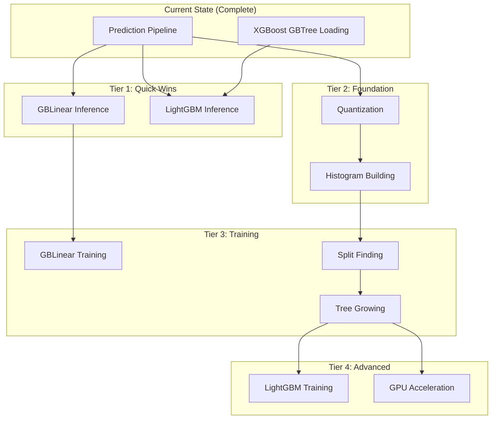
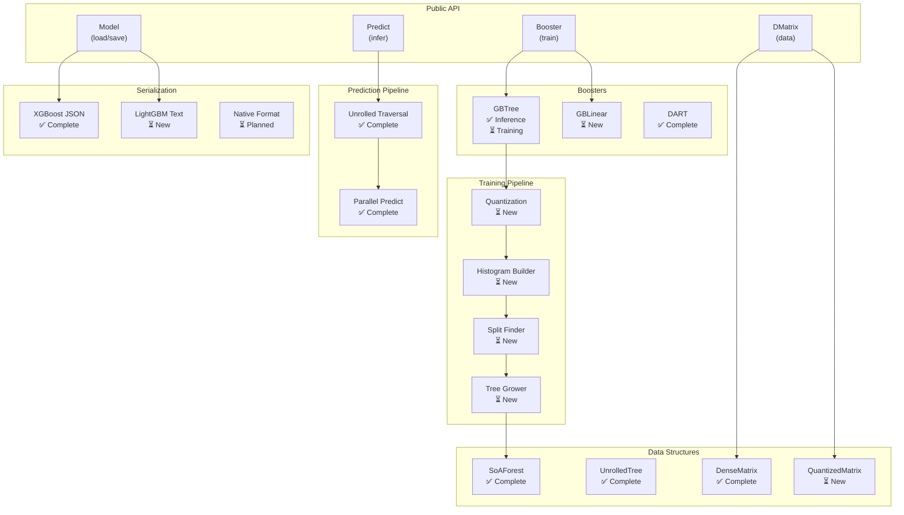

# RFC-0010: Future Features Research

- **Status**: Draft
- **Created**: 2024-11-29
- **Scope**: Research agenda and implementation roadmap for major new features

## Summary

With the core prediction pipeline complete and performing 3-10x faster than XGBoost C++,
this RFC outlines the research and implementation plan for the next major features:

1. **GBLinear** — Linear booster inference and training
2. **LightGBM Support** — Model loading and inference
3. **Training** — Gradient boosted tree training with histogram-based methods
4. **Quantization** — Feature quantization for training efficiency

## Feature Dependency Graph



## Recommended Research Order

Based on complexity, dependencies, and value:

| Order | Feature | Effort | Value | Rationale |
|-------|---------|--------|-------|-----------|
| 1 | GBLinear Inference | Small | Medium | Simple linear algebra, completes booster support |
| 2 | LightGBM Inference | Medium | High | Large user base, similar tree structure |
| 3 | Quantization | Medium | High | Foundation for training, enables memory optimization |
| 4 | GBLinear Training | Small | Medium | Simple coordinate descent, validates training infra |
| 5 | Histogram Building | Large | Critical | Core training primitive, enables tree training |
| 6 | Tree Training | Large | Critical | The main event - full GBTree training |

---

## Feature 1: GBLinear Inference & Training

### Overview

GBLinear is XGBoost's linear booster — essentially elastic net (L1/L2 regularized
linear regression) optimized with coordinate descent.

### Model Structure (from XGBoost C++)

```cpp
// GBLinearModel (gblinear_model.h)
class GBLinearModel {
    // Weight matrix: (num_features + 1) × num_output_groups
    // Last row is bias terms
    std::vector<bst_float> weight;
    
    // Access pattern:
    // weight[feature_idx * num_groups + group_idx] = coefficient
    // Bias() returns &weight[num_features * num_groups]
};
```

### Inference Algorithm

```rust
fn predict_linear(features: &[f32], weights: &LinearWeights) -> Vec<f32> {
    let mut outputs = vec![0.0; weights.num_groups];
    
    for group in 0..weights.num_groups {
        let mut sum = weights.bias(group);
        for (feature_idx, &value) in features.iter().enumerate() {
            sum += value * weights.coefficient(feature_idx, group);
        }
        outputs[group] = sum;
    }
    
    outputs
}
```

### Training Algorithm (Coordinate Descent)

```rust
// Shotgun: parallel coordinate descent
fn train_linear_step(
    data: &DMatrix,
    gradients: &[GradientPair],
    weights: &mut LinearWeights,
    params: &LinearParams,  // lambda_l1, lambda_l2
) {
    // For each feature (can be parallelized)
    for feature_idx in 0..num_features {
        // Compute gradient and hessian sums for this feature
        let (grad_sum, hess_sum) = compute_feature_stats(data, gradients, feature_idx);
        
        // Coordinate descent update with elastic net regularization
        let old_weight = weights.coefficient(feature_idx);
        let new_weight = soft_threshold(
            -grad_sum / hess_sum,
            params.lambda_l1 / hess_sum,
        ) / (1.0 + params.lambda_l2 / hess_sum);
        
        weights.set_coefficient(feature_idx, new_weight);
    }
}
```

### Research Tasks

- [ ] **R1.1**: Document XGBoost JSON format for GBLinear models
- [ ] **R1.2**: Understand coordinate descent variants (shotgun vs coord_descent)
- [ ] **R1.3**: Research convergence criteria and tolerance parameters

### Implementation Milestones

- **M-GBL.1**: GBLinear model loading from XGBoost JSON
- **M-GBL.2**: Linear prediction (inference only)
- **M-GBL.3**: Integration tests against Python XGBoost
- **M-GBL.4**: Coordinate descent training
- **M-GBL.5**: L1/L2 regularization (elastic net)

### Estimated Effort

- Inference: 2-3 days
- Training: 3-5 days

---

## Feature 2: LightGBM Model Support

### Overview

LightGBM is a widely-used gradient boosting framework with some differences from XGBoost:
- Different tree representation (leaf-wise growth vs level-wise)
- Different split finding (histogram-based with GOSS and EFB)
- Different categorical handling (optimal split finding)

### Model Format Analysis

LightGBM supports multiple formats:
1. **Text format** (`.txt`) — Human readable, documented
2. **Binary format** — Faster loading, undocumented
3. **JSON format** — `dump_model()` output

```python
# LightGBM model dump structure
{
    "name": "tree",
    "version": "v4",
    "num_class": 1,
    "num_tree_per_iteration": 1,
    "label_index": 0,
    "max_feature_idx": 99,
    "objective": "binary sigmoid:1",
    "feature_names": [...],
    "feature_infos": [...],
    "tree_info": [
        {
            "num_leaves": 31,
            "num_cat": 0,
            "shrinkage": 1,
            "tree_structure": {
                "split_index": 0,
                "split_feature": 5,
                "split_gain": 123.45,
                "threshold": 0.5,
                "decision_type": "<=",
                "default_left": true,
                "left_child": {...},
                "right_child": {...}
            }
        }
    ]
}
```

### Key Differences from XGBoost

| Aspect | XGBoost | LightGBM |
|--------|---------|----------|
| Tree growth | Level-wise | Leaf-wise |
| Split storage | Feature + threshold | Feature + threshold + gain |
| Categorical | Bitset membership | Optimal categorical split |
| Default direction | Per-node | Per-node |
| Leaf values | Single/vector | Single/vector |

### Research Tasks

- [ ] **R2.1**: Parse LightGBM text model format
- [ ] **R2.2**: Document tree structure differences
- [ ] **R2.3**: Understand categorical split representation
- [ ] **R2.4**: Research LightGBM "dart" mode (if different from XGBoost)
- [ ] **R2.5**: Investigate LightGBM+trees (RF mode) compatibility

### Implementation Milestones

- **M-LGB.1**: LightGBM text format parser
- **M-LGB.2**: Tree structure conversion to booste-rs format
- **M-LGB.3**: Categorical split handling
- **M-LGB.4**: Objective function mapping
- **M-LGB.5**: Integration tests against Python LightGBM
- **M-LGB.6**: (Optional) Binary format parser

### Estimated Effort

- Basic inference: 3-5 days
- Full compatibility: 1-2 weeks

---

## Feature 3: Quantization (Training Foundation)

### Overview

Quantization converts continuous feature values to discrete bins, enabling:
- Efficient histogram building (integer indexing)
- Reduced memory usage (u8/u16 instead of f32)
- Faster split finding (bin boundaries pre-computed)

### XGBoost Quantization Strategy

```cpp
// HistogramCuts (hist_util.h)
class HistogramCuts {
    HostDeviceVector<float> cut_values_;   // Bin boundaries
    HostDeviceVector<uint32_t> cut_ptrs_;  // CSC column pointers
    HostDeviceVector<float> min_vals_;     // Per-feature minimums
};

// GHistIndexMatrix (gradient_index.h)
class GHistIndexMatrix {
    // CSR format: row_ptr + quantized feature indices
    // Each entry is a bin index (u8, u16, or u32)
};
```

### Quantization Algorithm

```rust
/// Compute histogram bin boundaries using quantile sketch
fn compute_cuts(
    data: &DMatrix,
    max_bins: usize,       // Usually 256
    feature_types: &[FeatureType],
) -> HistogramCuts {
    let mut cuts = HistogramCuts::new();
    
    for feature_idx in 0..num_features {
        if feature_types[feature_idx].is_categorical() {
            // Categorical: one bin per category
            let categories = collect_unique_categories(data, feature_idx);
            cuts.add_categorical_bins(feature_idx, categories);
        } else {
            // Numerical: quantile-based bins
            let quantiles = weighted_quantile_sketch(
                data.column(feature_idx),
                data.weights(),
                max_bins,
            );
            cuts.add_numerical_bins(feature_idx, quantiles);
        }
    }
    
    cuts
}

/// Transform raw features to bin indices
fn quantize_row(row: &[f32], cuts: &HistogramCuts) -> Vec<BinIndex> {
    row.iter()
        .enumerate()
        .map(|(fidx, &value)| cuts.search_bin(fidx, value))
        .collect()
}
```

### Data Structures for Quantized Data

```rust
/// Quantized feature matrix (CSR format)
pub struct GHistIndexMatrix {
    /// Row pointers (CSR format)
    row_ptr: Vec<usize>,
    /// Bin indices (packed u8/u16/u32 based on total bins)
    index: QuantizedIndex,
    /// Histogram cut points
    cuts: HistogramCuts,
    /// Is this matrix dense?
    is_dense: bool,
}

/// Bin index storage with variable width
pub enum QuantizedIndex {
    U8(Vec<u8>),    // <= 256 total bins
    U16(Vec<u16>),  // <= 65536 total bins
    U32(Vec<u32>),  // > 65536 total bins
}
```

### Research Tasks

- [ ] **R3.1**: Study XGBoost quantile sketch algorithm
- [ ] **R3.2**: Understand weighted quantile computation
- [ ] **R3.3**: Research categorical bin handling
- [ ] **R3.4**: Document GHistIndexMatrix format
- [ ] **R3.5**: Investigate sparse vs dense quantized formats

### Implementation Milestones

- **M-QUANT.1**: `HistogramCuts` structure and bin search
- **M-QUANT.2**: Quantile sketch for numerical features
- **M-QUANT.3**: Categorical feature binning
- **M-QUANT.4**: `GHistIndexMatrix` construction
- **M-QUANT.5**: Sparse/dense format selection
- **M-QUANT.6**: Benchmark: quantization overhead

### Estimated Effort

- Basic quantization: 1 week
- Production-quality with sketch: 2 weeks

---

## Feature 4: Histogram Building

### Overview

Histograms aggregate gradients per bin, enabling O(bins) split finding instead of O(n).

### XGBoost Histogram Structure

```cpp
// GHistRow is a span of GradientPairPrecise
using GHistRow = Span<GradientPairPrecise>;

struct GradientPairPrecise {
    double grad;  // First-order gradient
    double hess;  // Second-order gradient (Hessian)
};
```

### Histogram Building Algorithm

```rust
/// Build histogram for a node's rows
fn build_histogram(
    node_rows: &[RowIndex],      // Rows belonging to this node
    gradients: &[GradientPair],  // Per-row gradients
    quantized: &GHistIndexMatrix,
    hist: &mut [GradientPair],   // Output: per-bin gradient sums
) {
    // Zero the histogram
    hist.fill(GradientPair::zero());
    
    // Accumulate gradients into bins
    for &row_idx in node_rows {
        let row_grad = gradients[row_idx];
        for bin_idx in quantized.row_bins(row_idx) {
            hist[bin_idx].accumulate(&row_grad);
        }
    }
}

/// Histogram subtraction trick
fn subtract_histogram(
    parent: &[GradientPair],
    sibling: &[GradientPair],
    child: &mut [GradientPair],
) {
    // child = parent - sibling
    // Avoids building histogram for one child
    for i in 0..parent.len() {
        child[i] = parent[i] - sibling[i];
    }
}
```

### Parallelization Strategy

XGBoost uses two-level parallelism:
1. **Row-parallel**: Different threads process different row subsets
2. **Feature-parallel**: Different threads process different features

```rust
/// Parallel histogram building with thread-local buffers
fn build_histogram_parallel(
    node_rows: &[RowIndex],
    gradients: &[GradientPair],
    quantized: &GHistIndexMatrix,
    num_bins: usize,
    num_threads: usize,
) -> Vec<GradientPair> {
    // Thread-local histograms
    let mut local_hists: Vec<Vec<GradientPair>> = 
        (0..num_threads).map(|_| vec![GradientPair::zero(); num_bins]).collect();
    
    // Parallel accumulation
    node_rows.par_chunks(CHUNK_SIZE)
        .zip(local_hists.par_iter_mut())
        .for_each(|(chunk, local_hist)| {
            for &row_idx in chunk {
                // ... accumulate into local_hist
            }
        });
    
    // Reduce thread-local histograms
    reduce_histograms(local_hists)
}
```

### Research Tasks

- [ ] **R4.1**: Study XGBoost `ParallelGHistBuilder`
- [ ] **R4.2**: Understand histogram subtraction optimization
- [ ] **R4.3**: Research cache-aware histogram building
- [ ] **R4.4**: Document column vs row-wise building tradeoffs

### Implementation Milestones

- **M-HIST.1**: Basic histogram structure
- **M-HIST.2**: Sequential histogram building
- **M-HIST.3**: Histogram subtraction
- **M-HIST.4**: Parallel histogram building
- **M-HIST.5**: Cache-optimized layout
- **M-HIST.6**: Benchmark vs XGBoost

### Estimated Effort

- Basic histograms: 3-5 days
- Optimized parallel: 1-2 weeks

---

## Feature 5: Tree Training

### Overview

Tree training finds the best splits at each level and grows the tree.

### Split Finding Algorithm

```rust
/// Evaluate all possible splits for a node
fn find_best_split(
    histogram: &[GradientPair],
    cuts: &HistogramCuts,
    node_stats: &GradientPair,  // Sum of gradients in node
    params: &TreeParams,
) -> Option<SplitInfo> {
    let mut best_split = None;
    let mut best_gain = 0.0;
    
    for feature_idx in 0..num_features {
        let feature_bins = cuts.feature_range(feature_idx);
        
        // Scan bins left-to-right
        let mut left_stats = GradientPair::zero();
        
        for (bin_offset, bin_idx) in feature_bins.enumerate() {
            left_stats.accumulate(&histogram[bin_idx]);
            let right_stats = *node_stats - left_stats;
            
            let gain = compute_split_gain(
                &left_stats,
                &right_stats,
                node_stats,
                params,
            );
            
            if gain > best_gain {
                best_gain = gain;
                best_split = Some(SplitInfo {
                    feature: feature_idx,
                    threshold: cuts.bin_threshold(bin_idx),
                    gain,
                    left_stats,
                    right_stats,
                });
            }
        }
    }
    
    best_split
}

/// XGBoost's gain formula
fn compute_split_gain(
    left: &GradientPair,
    right: &GradientPair,
    parent: &GradientPair,
    params: &TreeParams,
) -> f64 {
    let gain_left = (left.grad * left.grad) / (left.hess + params.lambda);
    let gain_right = (right.grad * right.grad) / (right.hess + params.lambda);
    let gain_parent = (parent.grad * parent.grad) / (parent.hess + params.lambda);
    
    0.5 * (gain_left + gain_right - gain_parent) - params.gamma
}
```

### Tree Growing Strategy

XGBoost supports two strategies:
1. **Level-wise** (default): Grow all nodes at same depth, then go deeper
2. **Leaf-wise** (LightGBM style): Grow the leaf with highest gain

```rust
/// Level-wise tree growing
fn grow_tree_level_wise(
    data: &GHistIndexMatrix,
    gradients: &mut [GradientPair],
    params: &TreeParams,
) -> Tree {
    let mut tree = Tree::new();
    let mut current_level = vec![NodeId::ROOT];
    
    for depth in 0..params.max_depth {
        let mut next_level = Vec::new();
        
        // Build histograms for all nodes at current level
        let histograms = build_level_histograms(&current_level, data, gradients);
        
        for (node_id, histogram) in current_level.iter().zip(histograms.iter()) {
            if let Some(split) = find_best_split(histogram, &data.cuts, params) {
                // Apply split
                let (left_id, right_id) = tree.split_node(*node_id, split);
                next_level.push(left_id);
                next_level.push(right_id);
                
                // Update row positions
                partition_rows(data, &split, *node_id, left_id, right_id);
            } else {
                // Make leaf
                tree.make_leaf(*node_id, compute_leaf_value(histogram, params));
            }
        }
        
        current_level = next_level;
        if current_level.is_empty() {
            break;
        }
    }
    
    tree
}
```

### Research Tasks

- [ ] **R5.1**: Study XGBoost `Driver` class (tree growing orchestration)
- [ ] **R5.2**: Understand row partitioning and position updates
- [ ] **R5.3**: Research regularization parameters (gamma, lambda, alpha)
- [ ] **R5.4**: Document shrinkage (learning rate) application
- [ ] **R5.5**: Study multi-class training (one-vs-all vs softmax)
- [ ] **R5.6**: Investigate DART training specifics

### Implementation Milestones

- **M-TRAIN.1**: Split gain computation
- **M-TRAIN.2**: Best split finding per node
- **M-TRAIN.3**: Row partitioning
- **M-TRAIN.4**: Level-wise tree growing
- **M-TRAIN.5**: Early stopping
- **M-TRAIN.6**: Shrinkage and regularization
- **M-TRAIN.7**: Multi-class support
- **M-TRAIN.8**: DART training (dropout)
- **M-TRAIN.9**: Benchmark vs XGBoost

### Estimated Effort

- Basic training: 2-3 weeks
- Production-quality: 4-6 weeks

---

## Updated Architecture Diagram



---

## Revised Roadmap

### Phase 5: Additional Boosters

#### Milestone 5.1: GBLinear Inference
- [ ] `LinearModel` structure (weights + bias)
- [ ] XGBoost JSON parsing for `gblinear` models
- [ ] `predict_linear()` function
- [ ] Integration tests

#### Milestone 5.2: LightGBM Inference
- [ ] LightGBM text format parser
- [ ] Tree structure conversion
- [ ] Categorical split handling
- [ ] Integration tests

### Phase 6: Quantization & Histograms

#### Milestone 6.1: Feature Quantization
- [ ] `HistogramCuts` structure
- [ ] Quantile sketch algorithm
- [ ] `GHistIndexMatrix` construction

#### Milestone 6.2: Histogram Building
- [ ] `GradientPair` accumulator
- [ ] Sequential histogram building
- [ ] Parallel histogram building
- [ ] Histogram subtraction optimization

### Phase 7: Training Pipeline

#### Milestone 7.1: GBLinear Training
- [ ] Coordinate descent updater
- [ ] Elastic net regularization
- [ ] Convergence checking

#### Milestone 7.2: Tree Training
- [ ] Split gain computation
- [ ] Best split finding
- [ ] Row partitioning
- [ ] Level-wise tree growing

#### Milestone 7.3: Training Integration
- [ ] Learning rate / shrinkage
- [ ] Early stopping
- [ ] Validation set evaluation
- [ ] Multi-class support

---

## Open Questions

1. **Scope of training support**: Full parity with XGBoost or "good enough" subset?
2. **GPU training**: Worth pursuing or focus on CPU first?
3. **Distributed training**: In scope or out of scope?
4. **LightGBM training**: Worth supporting or inference-only?
5. **Memory efficiency**: Prioritize low memory or speed?

---

## References

### XGBoost C++ Source
- `src/gbm/gblinear.cc` — Linear booster implementation
- `src/gbm/gbtree.cc` — Tree booster implementation
- `src/common/hist_util.h` — Histogram utilities
- `src/data/gradient_index.h` — Quantized data structure
- `src/tree/updater_quantile_hist.cc` — Histogram-based tree updater

### LightGBM
- [Model format documentation](https://lightgbm.readthedocs.io/)
- [Python API](https://lightgbm.readthedocs.io/en/latest/Python-API.html)

### Papers
- Chen & Guestrin (2016) "XGBoost: A Scalable Tree Boosting System"
- Ke et al. (2017) "LightGBM: A Highly Efficient Gradient Boosting Decision Tree"
